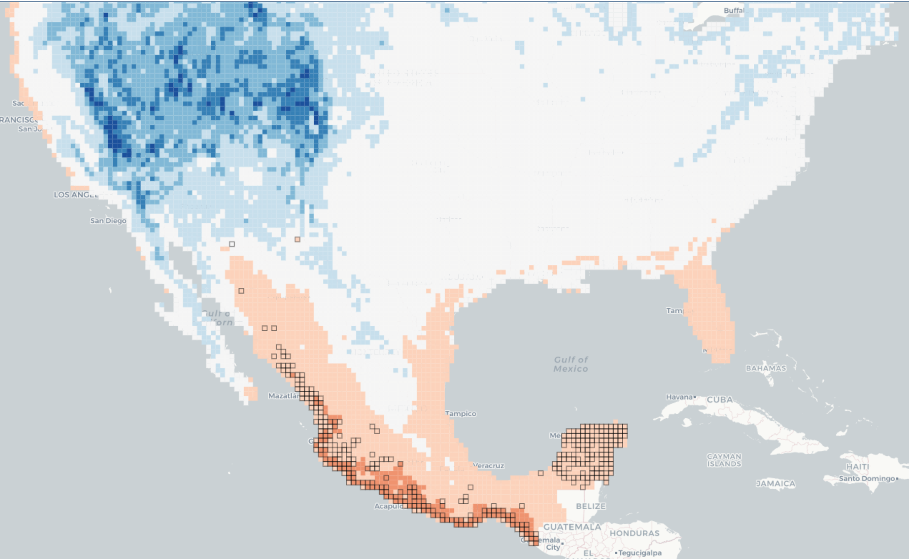

## (e)SpEcIES

### ¿Qué es (e)SpEcIES?

SpEcIEs viene de **S**istema **p**ara la **E**xplora**c**ión de **I**nformación **Es**pacial. Es una herramienta para analizar grandes bases de datos de ocurrencias de especies. Con SpEcIEs queremos ofrecer una nueva perspectiva sobre este tipo de información que ayude a entenderla como un sistema donde se entrelazan todos los organismos descritos en la base de datos. 

### ¿A quién está dirigido el proyecto?

Inicialmente está dirigido a personas que ya usan este tipo de información, más adelante esperamos que sea una herrmienta para explorar no sólo los datos sino que sirva como herrmienta de divulgación para acercarnos a la complejidad de los sistemas ecológicos y su estudio.

### ¿Cómo uso SpEcIEs?

Tenemos dos modalidades, la primera permite analizar un organismo focal desde la perspectiva de su relación con otros organismos y otras variables abioticas como el clima. Para usar ese modo sólo sigue la siguiente liga:

[][ss1]

[ss1]: niche-screenshot.png
